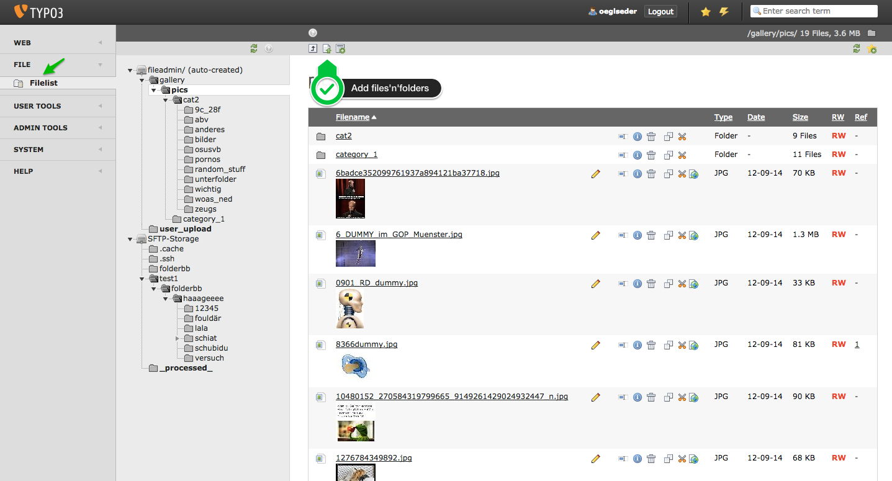
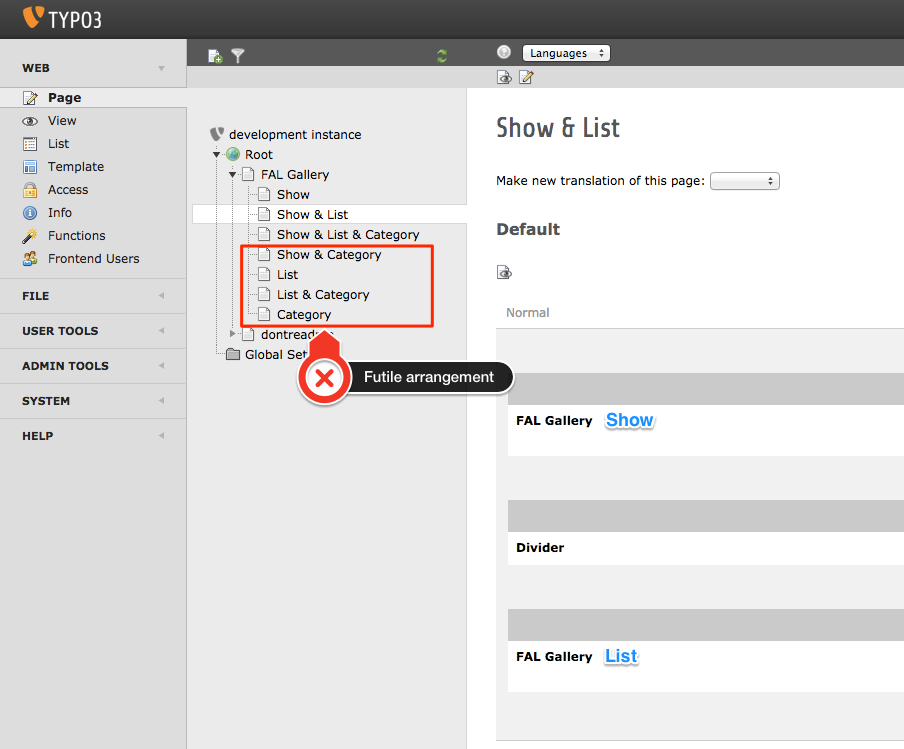
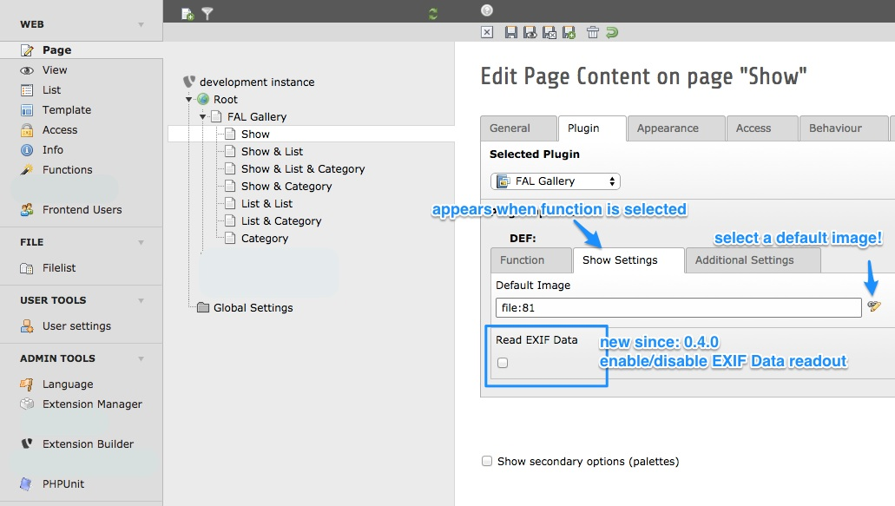
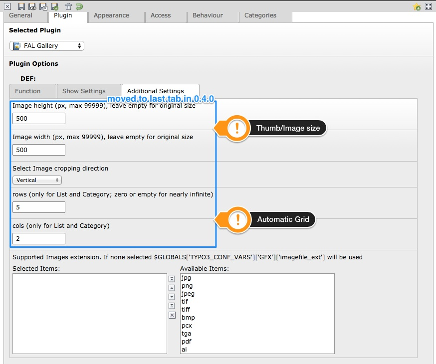
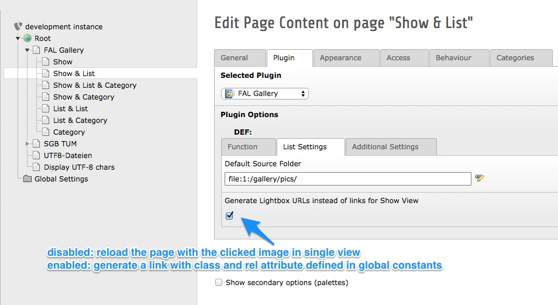
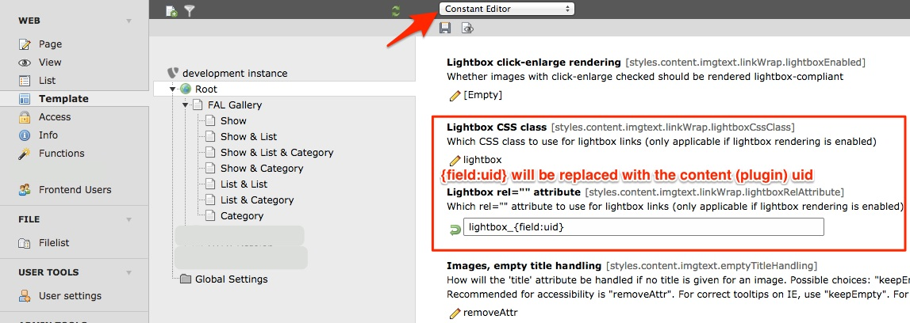

Usage
=====

Short'n'quick
-------------

1. Think of a wise folder structure
2. Create that folder structure in a file storage of your choice
3. Arrange the List and Single View according to your needs, add the Gallery View if necessary
4. Choose a Folder for List and Gallery View, choose a default image for the Single View
5. Open the Frontend to check everything
6. Have fun and browse your Gallery

Long and detailed
-----------------

Login to the Backend. Select the Filelist module and open a folder to start creating your gallery structure.
Add folders and files that represent galleries and sub-galleries (there is no limits to the depth of your folder structures)

Next go to the Pagemodule and insert FAL Gallery Plugins where needed.
Notice that only arrangements of Plugin Views where at least a "List View" with option "" and a "Single View" is present makes sense.

You can start with the Single View. Choose a default image that is shown when the page with the Plugin is opened first.
This image may be any image in your TYPO3 environment.
When Single View is selected, you may enable the EXIF Data readout.
Notice that the results of the readout are not cached and may slow down your page.

In the "Additional Settings" tab you may specify the image height and width settings for the Single View image.
If Gallery or List View is chosen instead, these Settings will affect the size of the Thumbnails.
Additionally, rows and cols can be specified for List and Gallery View. When there are more Images in a folder than cols*rows,
automatical pagination is activated.
Notice that setting width and height will distort the image, when the picture size does not match your selected sizes.

Next add a new FAL Gallery Plugin and select the List View. Select the folder you wan't to show as Thumbnails.
Select the Thumbnail size as needed and configure your Thumbnail Grid. "cols" is short for Columns.
All images from that folder, which match the selected file type, will be shown as Thumbnails in the Grid.
If the Grid has only 2 cols and 2 rows, a maximum of 4 Images is shown. If there are more than 4 Images in the selected Folder,
pagination will be enabled automatically.

Lightbox support (since 0.4.0): Enable this option to generate links for lightbox/fancybox instead of showing the image in Single View.

You can configure your global lightbox handling in the constant editor.

On top of that you might add a Gallery View, that allows the Frontend User to navigate trough your folders.
Select a root folder. In the Frontend you will see that this view generates thumbnails from the first picture inside each subfolder.
When you click on one of these images, the subfolder is selected and thumbnails for the subfolder's subfolders are shown, and so on.
When you are inside a subfolder, you can navigate upwards again until you reach the original root folder.
